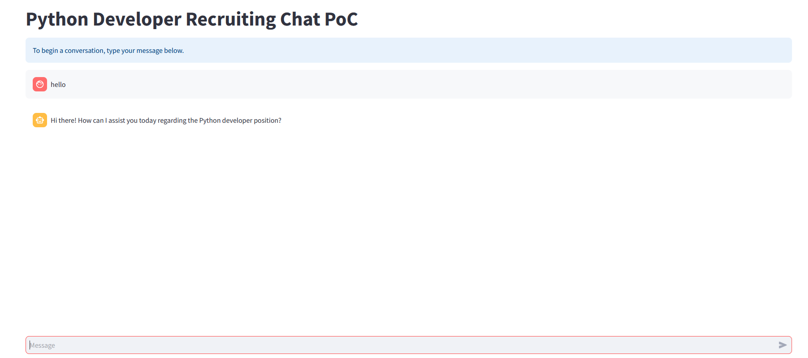

<!-- PROJECT LOGO -->
<p align="center">
  
</p>

<h1 align="center">Recruiting Chatbot PoC</h1>

<p align="center">
  SMS-style recruiting assistant for a Python Developer role<br>
  <a href="#usage">Usage</a>
  ·
  <a href="#getting-started">Getting Started</a>
  ·
  <a href="#project-structure">Project Structure</a>
</p>

---
<br></br>

## Table of Contents

- [About The Project](#about-the-project)
- [Features](#features)
- [Getting Started](#getting-started)
- [Usage](#usage)
- [Screenshots](#screenshots)
- [Code Examples](#code-examples)
- [Project Structure](#project-structure)
- [To-Do List](#to-do-list)
- [License](#license)
- [Contact](#contact)
- [Acknowledgments](#acknowledgments)

---
<br></br>


## About The Project

> A proof-of-concept recruiting chatbot where candidates chat in SMS-style turns. A main agent routes to specialized advisors for job questions (RAG over a job-description PDF) and interview scheduling (SQL Server).<br>

<div style="background: #272822; color: #f8f8f2; padding: 10px; border-radius: 8px;">
  <b> Technologies:</b> Python, LangChain, OpenAI, Streamlit, ChromaDB, pandas, pyodbc, pymssql, SQL Server
</div>

**Architecture**

```
User message
    │
    ▼
MainAgent (gpt-4o-mini, in-memory history)
    │
    ├─ "Let me find that information for you." → InfoAdvisor (RAG tool)
    │
    └─ "I will check available slots for you." → ScheduleAdvisor (SQL tools)
```

Prompts in `prompts/` control routing, clarification, scheduling rules, and job-info behavior.

**Model optimization** — `optimize/model_optimization.ipynb` experiments with the exit-advisor prompt using the [OpenAI Evals API](https://platform.openai.com/docs/guides/evals). It uploads labeled SMS conversation turns (`sms_conversations_final.jsonl`), runs completion evals against human labels (`end` / `continue` / `schedule`), compares baseline vs few-shot prompts, and reports accuracy via the OpenAI evaluation dashboard.

**Database seed** — `sql/seed_schedule.sql` bootstraps the `Tech` database used by the schedule advisor: creates `Schedule` and `InterviewBooking` tables, seeds 2026 interview slots for four roles, and sets up indexes for booking lookups.

---
<br></br>


## Features

- [x] Multi-agent orchestration (MainAgent → InfoAdvisor / ScheduleAdvisor)
- [x] Job information via RAG (ChromaDB + OpenAI embeddings)
- [x] Interview scheduling tools (`get_schedule`, `interview_booking`, `update_interview`, `cancel_interview`)
- [x] SQL Server seed script (`sql/seed_schedule.sql`) for `Tech` database and sample 2026 slots
- [x] Dual SQL Server backends (`pyodbc` / `pymssql`)
- [x] Streamlit web UI and terminal CLI
- [x] Session logging to `logs/sessions/`
- [x] Exit-advisor prompt optimization notebook (`optimize/model_optimization.ipynb`)
- [x] <span style="color: green; font-weight: bold;">Prompt-driven behavior (easy to customize)</span>
- [ ] Cloud deployment _(coming soon!)_

---
<br></br>


## Getting Started

### Prerequisites

- Python >= 3.10 (3.11 recommended)
- pip
- OpenAI API key
- SQL Server with the `Tech` database
- For `pyodbc`: ODBC Driver 17 for SQL Server (or set `MSSQL_DRIVER`)

### Installation

```bash
git clone https://github.com/alon-kabi/genai-project.git
cd genai-project
python -m venv .venv

# Windows
.\.venv\Scripts\activate
pip install -r requirements.txt

# macOS / Linux
source .venv/bin/activate
pip install -r requirements.txt
```

### Environment variables

Create a `.env` file in the project root:

```env
OPENAI_API_KEY=sk-...

MSSQL_BACKEND=pyodbc
MSSQL_SERVER=localhost
MSSQL_DATABASE=Tech
MSSQL_USER=your_user
MSSQL_PASSWORD=your_password
MSSQL_DRIVER=ODBC Driver 17 for SQL Server
```

Use `MSSQL_BACKEND=pymssql` only if TCP connectivity to SQL Server is enabled and `pyodbc` is unavailable.

### Job description PDF

Place the job description at:

```text
data/docs/Python Developer Job Description.pdf
```

The PDF is embedded into an in-memory Chroma collection on each run.

### Database setup

Run `sql/seed_schedule.sql` against your SQL Server instance before using the schedule advisor.

**What it creates**

| Object | Purpose |
|--------|---------|
| `Tech` database | Target DB (created if missing) |
| `Schedule` | Available interview slots (`Available` 0/1, `MeetingType` Zoom/Office) |
| `InterviewBooking` | Booked interviews with candidate details and status |

**Sample data**

- Full **2026** calendar: every weekday slot from 09:00–17:00
- Positions: `Python Dev`, `SQL Dev`, `Data Analyst`, `ML Engineer`
- ~70% of generated slots marked available (`Available = 1`); meeting type assigned per row

**How to run**

In SQL Server Management Studio, open `sql/seed_schedule.sql` and execute against your instance.

Or from the command line (`sqlcmd`):

```bash
sqlcmd -S localhost -U your_user -P your_password -i sql/seed_schedule.sql
```

Match `MSSQL_SERVER`, `MSSQL_USER`, `MSSQL_PASSWORD`, and `MSSQL_DATABASE=Tech` in `.env` to the server where you ran the script.

> **Warning:** The script drops and recreates `Schedule` and `InterviewBooking`. Do not run it against a database that already holds production booking data.

---
<br></br>


## Usage

Always run commands from the **project root** (`genai-project`).

### Streamlit UI

```bash
streamlit run app.py
```

### Terminal CLI

```bash
python -m src.main
```

CLI commands:

- `exit` — quit
- `dump` — write the current session log to `logs/sessions/` and exit

On errors, session dumps (including traceback) are written automatically.

### Model optimization (Jupyter)

Open and run `optimize/model_optimization.ipynb` from the project root (requires Jupyter and a valid `OPENAI_API_KEY` in `.env`):

```bash
jupyter notebook optimize/model_optimization.ipynb
```

The notebook:

1. Prototypes exit-advisor prompts with `gpt-4.1`
2. Creates an OpenAI Eval (`Exit Advisor Decision Routing`)
3. Uploads `optimize/sms_conversations_final.jsonl` as the eval dataset
4. Runs baseline and few-shot prompt trials and compares pass/fail counts
5. Loads improved prompts from files in `optimize/` (e.g. `few_shot_prompt_trial.txt`, `few_shot_prompt_exit_advisior.txt`)

Place the eval dataset and prompt files alongside the notebook before running:

```text
optimize/
├── model_optimization.ipynb
├── sms_conversations_final.jsonl   # labeled conversation turns
├── few_shot_prompt_trial.txt
└── few_shot_prompt_exit_advisior.txt
```

Successful runs produce an evaluation report URL on the OpenAI platform. Apply winning prompts back to `prompts/exit_prompt.txt` in the main app.

---
<br></br>


## Screenshots

<p align="center">
  
</p>

---
<br></br>


## Code Examples

```python
from src.shared import ConversationManager

manager = ConversationManager()
session_id = manager.create_session_id()

response = manager.run_turn(
    "Can we schedule an interview for next Friday?",
    session_id,
)
print(response["message"])
```

```python
# Scheduling tools (used by ScheduleAdvisor) — backed by sql/seed_schedule.sql tables
# get_schedule       — query Schedule (Position LIKE, month/year/day)
# interview_booking  — INSERT InterviewBooking + mark Schedule.Available = 0
# update_interview   — reschedule; claim new slot, release old slot
# cancel_interview   — Status = 'Cancelled' + release Schedule slot
```

Schema created by `sql/seed_schedule.sql`:

```sql
-- Schedule: slot inventory
CREATE TABLE dbo.Schedule (
    ScheduleID    INT IDENTITY(1,1) PRIMARY KEY,
    [Date]        DATE NOT NULL,
    InterviewTime TIME(0) NOT NULL,
    Position      VARCHAR(50) NOT NULL,
    Available     BIT NOT NULL,
    MeetingType   VARCHAR(10) NOT NULL   -- Zoom | Office
);

-- InterviewBooking: confirmed bookings
CREATE TABLE dbo.InterviewBooking (
    BookingID       INT IDENTITY(1,1) PRIMARY KEY,
    Position        VARCHAR(100) NOT NULL,
    Interview_date  DATE NOT NULL,
    Interview_time  TIME(0) NOT NULL,
    Interview_type  VARCHAR(100) NOT NULL,
    Status          VARCHAR(20) NULL,
    CandidateName   NVARCHAR(100) NULL,
    CandidatePhone  VARCHAR(20) NULL,
    CreatedDate     DATETIME NOT NULL DEFAULT GETDATE(),
    UpdatedDate     DATETIME NULL
);
```

From `optimize/model_optimization.ipynb` — create and run an exit-advisor eval:

```python
from openai import OpenAI

client = OpenAI()

eval_obj = client.evals.create(
    name="Exit Advisor Decision Routing",
    data_source_config={
        "type": "custom",
        "item_schema": {
            "type": "object",
            "properties": {
                "conversation_id": {"type": "integer"},
                "turn_id": {"type": "integer"},
                "model_input": {"type": "string"},
                "label": {"type": "string"},
            },
            "required": ["conversation_id", "turn_id", "model_input", "label"],
        },
        "include_sample_schema": True,
    },
    testing_criteria=[{
        "type": "string_check",
        "name": "Match exit decision to human label",
        "input": "{{ sample.output_text }}",
        "operation": "eq",
        "reference": "{{ item.label }}",
    }],
)

file = client.files.create(
    file=open("optimize/sms_conversations_final.jsonl", "rb"),  # run notebook from optimize/ or adjust path
    purpose="evals",
)

run = client.evals.runs.create(
    eval_obj.id,
    name="Exit Advisor Decision Routing Run",
    data_source={
        "type": "completions",
        "model": "gpt-4.1",
        "input_messages": {
            "type": "template",
            "template": [
                {"role": "developer", "content": instructions},
                {"role": "user", "content": "{{ item.model_input }}"},
            ],
        },
        "source": {"type": "file_id", "id": file.id},
    },
)
```

---
<br></br>


## Project Structure

```text
genai-project/
├── app.py                      # Streamlit entry point
├── prompts/                    # System prompts (main, schedule, info, …)
├── data/
│   └── docs/                   # Job description PDF for RAG
├── sql/
│   └── seed_schedule.sql       # Tech DB: Schedule + InterviewBooking + 2026 seed data
├── logs/
│   └── sessions/               # Session JSON dumps (gitignored)
├── optimize/
│   ├── model_optimization.ipynb        # Exit-advisor eval & prompt tuning
│   ├── sms_conversations_final.jsonl   # Eval dataset (add before running)
│   ├── few_shot_prompt_trial.txt       # Few-shot prompt variants
│   └── few_shot_prompt_exit_advisior.txt
├── src/
│   ├── main.py                 # CLI entry point
│   └── shared/
│       ├── conversation_manager.py
│       ├── main_agent.py       # Orchestrator
│       ├── info_advisor.py     # RAG job-info agent
│       ├── schedule_advisor.py # Scheduling tools + agent
│       ├── mssql_backend.py    # pyodbc / pymssql abstraction
│       ├── session_logger.py
│       ├── exit_advisor.py
│       └── rag/
│           └── chroma_client.py
├── requirements.txt
└── README.md
```

---
<br></br>


## To-Do List

- [x] Initial project setup
- [x] Main agent and advisor orchestration
- [x] RAG job-info advisor (ChromaDB)
- [x] Schedule advisor with SQL Server tools
- [x] Database seed script (`sql/seed_schedule.sql`)
- [x] Streamlit web interface
- [x] Session logging and dumps
- [x] Exit-advisor eval notebook (`optimize/model_optimization.ipynb`)
- [ ] Integrate optimized exit-advisor prompt into production flow
- [x] Add project screenshots
- [ ] Cloud deployment


---
<br></br>


## License

Internal proof-of-concept — no license specified.

---
<br></br>


## Contact

**Alon Kabilo** — [kabilofamily@hotmail.com](mailto:kabilofamily@hotmail.com)  
Project Link: [https://github.com/alon-kabi/genai-project](https://github.com/alon-kabi/genai-project)

---
<br></br>


## Acknowledgments

- [Python](https://www.python.org/)
- [LangChain](https://python.langchain.com/)
- [OpenAI API](https://platform.openai.com/docs/overview)
- [Streamlit](https://streamlit.io/)
- [ChromaDB](https://www.trychroma.com/)
- [pandas](https://pandas.pydata.org/)


---
